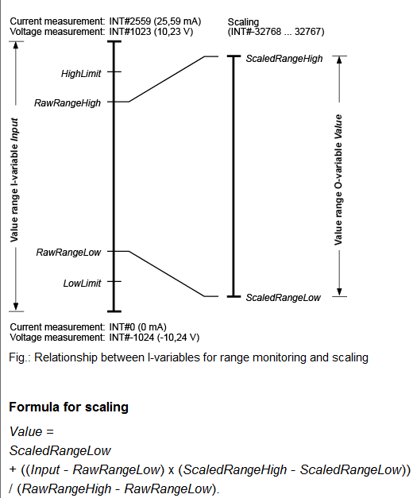

# TMA IS Design

| **Requested by:**           | **Ghesa**         |
|-----------------------------|-------------------|
| **Doc. Code:**              | 3151_MCS_0007     |
| **Editor:**                 | Julen             |
| **Approved by:**            | Alberto           |

## Introduction

In the Safety Review and Hazard Analysis [Ref. 1] possible events that may occur during TMA operation are defined (causes).
To prevent human damage as well as machine damage precisely defined reactions (effects) are specified for each event (cause).

This assignation has been done by means of the cause/effect matrix, also known as the Safety Matrix, which is the main
input to define the behavior of the safety system. This Safety Matrix is detailed in Ref. 1 and is not repeated in this
document which aims to describe the hardware system selected to implement that Safety Matrix.

## Reference documents

| **Nº** | **Document**                                                             | **Code**           | **Version** |
|--------|--------------------------------------------------------------------------|--------------------|-------------|
| **1**  | Safety Review and Hazard Analysis                                        | 092-308-E-Z-00001  | (Draft 2)   |
| **2**  | LSST Summit Safety Interlock System                                      | LTS-99             |             |
| **3**  | Telescope Mount Assembly to Interlock System Interface Control Document” | LTS-173            |             |
| **4**  | TMA Safety Hazard Analysis 24-04-2013                                    | 14428              | V2          |
| **5**  | TMA IS Equipment General Description                                     | 3151_MCS_0008      | V3.12       |
| **6**  | TMA IS IO HW List                                                        | 3151_MCS_0017      | V2.8        |
| **7**  | TMA Electrical drawing                                                   | 3151_MCS_0022      | V9          |

## HW Design

The safety control hardware used in the TMA IS is based on PILZ hardware, specifically the PILZ PSS4000 family.

The design is based in one central safety CPU and distributed/remote I/Os around the machine, this design removes any
limitation in the number of analog inputs, digital inputs and digital outputs. That means that there is just one
programable device (the CPU) in the system, all the safety instructions (independently of where the input or output is)
are programmed in this CPU. The coding is done using the engineering tool provided by PILZ for the PSS4000 device family,
the PAS4000 software.

### PILZ PSS4000 hardware

The connection between the Safety CPU and the distributed I/Os is done using PILZ’s SafetyNet p, a safe Ethernet network,
certified for data transfer in accordance with SIL 3 of IEC 61508. PSSu PLC systems of all performance classes can be
used up to SIL 3 of EN 62061 and up to PL e (Cat 4) of EN ISO 13849-1.

The use of these remote I/Os enables using up to 64 input modules on each remote station, and has no limitations on
the number of analog inputs that can be used.

In terms of the topology, SafetyNet p supports various familiar Ethernet architectures, so modular system architectures
and individual subnets can be implemented, to divide automation functions and largely independent function units.

An example of a simple PSSu system is shown in the following figure.


The automation system PSS4000 handles non-safety functions (ST functions), for control, motion and visualizations, as
well safety-related functions (FS functions). But in the TMA the motion and visualizations tasks will are executed in
the PXI controller and PSS4000 system is only responsible of the safety-related functions, so all modules used in it are
fail-safe (FS) modules. The maximum number of variables each Safety CPU can handle are 5000 ST data types and 4000 FS
data types.

As the installation site is over 2000m altitude and the operation range goes below 0 degrees celsius, the selected
hardware has improved environmental requirements. This is represented by a `–T` added to the part number. This means
that the modules used in the TMA can be placed in electrical cabinets without thermal insulation. Main environment
features are, operation at <5000m altitude and -40ºC to 70ºC ambient temperature.

The fail-safe digital outputs available can be of two types, semiconductor technology or relay contacts. Each of them
with a different performance level:

| Technology    | Channels  | Safety ratting   |
|---------------|-----------|------------------|
| Relay         | 1-channel | PL c Cat 1       |
| Semiconductor | 2-channel | PL e Cat 4 SIL 3 |
|               | 1-channel | PL d Cat 2 SIL 2 |
|               | 2-channel | PL e Cat 4 SIL 3 |

As the design criteria is to provide at least a performance level of PL d, if the device is a single channel a
semiconductor output is used and when dry contact is necessary, a relay output with two channel is used. The selected
devices are listed in the
[TMA IS Equipment General Description](https://gitlab.tekniker.es/publico/3151-lsst/documentation/tma_is_equipment_general_description)
document.

### PSS4000 Advantages

The PSS4000 family hardware configuration has been selected due to its better performance compared to the PILZ Multi family:

- The safety program is executed in only one failsafe CPU. The maintenance of a single program is easier and more
  efficient in just one CPU instead of several controllers (case of the Multi Option)
- The number of decentralized I/Os that can be used is high, and there won’t be any limitation in the number of analog
  inputs. In case of using the Multi, the number of analog inputs that can be used for each controller is maximum six
  and it can only handle two expansion modules.
- The reactions times on the PSS4000 to an input are faster compared to a multi configuration, due to multiple controller
  communication: on multi configuration a controller must process the signals before sending the signals to the other controller.
- Easily expandable by adding another remote I/O, connecting to the SafetyNET network, an Ethernet cable to switch.

In conclusion, the selected hardware is more flexible, making it easier to maintain, expand and modify.

## TMA IS architecture

In order to simplify and reduce wiring, the configuration selected for the safety system is similar to the one used by
the control system, that is, a CPU located in the main cabinet and I/O distributed modules in different TMA electrical
cabinets.


The safety system configuration is:

- Safety CPU in TMA-AZ-CS-CBT-0001
- Decentralized I/O in TMA-AZ-CS-CBT-0101
- Decentralized I/O in TMA-EL-CS-CBT-0101
- Decentralized I/O in TMA-EL-CS-CBT-0102
- Decentralized I/O in TMA-PI-CS-CBT-0101

As mentioned, communication between the Safety CPU and the remote I/Os is done through the SafetyNet p in a star network
using a switch. In this case instead of a Cisco switch a Moxa switch is used, as the Cisco one is not certified for
SafetyNetwork and the temperature range for operation is only 0-60 °C.

### Safety CPU in TMA-AZ-CS-CBT-0001

The TMA IS CPU is located in the main cabinet in the Azimuth platform, cabinet TMA-AZ-CS-CBT-0001.

The master unit has two RJ45 ports, because it has and internal switch to chain components, they can be configured as
normal Ethernet port or SafetyNet p port. In this case as it is more appropriate to build a star configuration, only
one is used to connect to the remote I/Os using the Moxa switch, this port is configured as SafetyNet p, and the other
as a normal Ethernet port to connect to the PXI through a ModBus protocol, this connection does not need to be a safety
connection.

The signals wired to the Safety CPU module inside this cabinet can be found in the latest version of the
[Electrical Schematics](https://gitlab.tekniker.es/publico/3151-lsst/documentation/electricalschematics).

### Decentralized I/Os in TMA-AZ-CS-CBT-0101

The decentralized I/O is located in an auxiliary cabinet in the opposite side of the Azimuth platform, TMA-AZ-CS-CBT-0101.

The signals wired to the remote I/O module inside this cabinet can be found in the latest version of the
[Electrical Schematics](https://gitlab.tekniker.es/publico/3151-lsst/documentation/electricalschematics).

### Decentralized I/Os in TMA-EL-CS-CBT-0101

The decentralized I/O is located in an auxiliary cabinet inside the elevation central section (CST), TMA-EL-CS-CBT-0101.

The signals wired to the remote I/O module inside this cabinet can be found in the latest version of the
[Electrical Schematics](https://gitlab.tekniker.es/publico/3151-lsst/documentation/electricalschematics).

### Decentralized I/Os in TMA-EL-CS-CBT-0102

The decentralized I/O is located in an auxiliary cabinet inside the elevation central section (CST), TMA-EL-CS-CBT-0102.

The signals wired to the remote I/O module inside this cabinet can be found in the latest version of the
[Electrical Schematics](https://gitlab.tekniker.es/publico/3151-lsst/documentation/electricalschematics).

### Decentralized I/Os in TMA-PI-CS-CBT-0101

The decentralized I/O is located in an auxiliary cabinet below the TMA in level 6, TMA-PI-CS-CBT-0101.

The signals wired to the remote I/O module inside this cabinet can be found in the latest version of the
[Electrical Schematics](https://gitlab.tekniker.es/publico/3151-lsst/documentation/electricalschematics).

> As a rule, all I/O should be FS modules, but in this cabinet there is an exception, the counter module for the Azimuth
> encoder cannot be a FS module, as this module can ONLY be connected to a CPU module. That's why, a standard non FS
> module is used, to avoid the need of routing the Azimuth encoder wire all the way up to the Azimuth platform, to
> wire it to the safety CPU inside the TMA-AZ-CS_CBT-0001 cabinet.

## Safety Network

As mentioned before, for the safety network specific switches must be used, in this case the MOXA EDS-408A-MM-SC. For
accomplishing the designed architecture, 2 switches have been installed, one in the TMA-AZ-CS-CBT-0001 cabinet and another
in the TMA-PI-CS-CBT-0101 cabinet. Giving the following connection scheme:


## Modbus mapping

The communication between the TMA-PXI and the SafetyCPU is done using Modbus. The SafetyCPU has a Modbus server installed
that sends and receives the variables specified in the upcoming tables for transmitting the required data. For this
transmission, the mapping is defined in the PAS4000 coding application. Is important to keep in mind that in the modbus
server implemented in the PILZ the addresses can be read or write, not both at the same time.

For the boolean variables the following logic is used:

- 1 (true): the variable is active
- 0 (false): the variable is not active

### Read variables

These are the variables published to the PXI. The address 0 refers to 4x0000.

| Variable Name              | Address   | Bit      |   Type         |   Description                                   |
|----------------------------|-----------|----------|----------------|-------------------------------------------------|
| EmergencyStopWord1         |   0       |   -1     |   U16          |   Word for emergency stops 1 |
| sdiETMCS                   |   0       |   0      |   Boolean      |   ETPB for Startup or CCWAUX Cabinet |
| sdiETAZBP1                 |   0       |   1      |   Boolean      |   ETPB Azimuth area +X beam 1 (TMA-AZ-IS-PSB-0001) |
| sdiETAZBP2                 |   0       |   2      |   Boolean      |   ETPB Azimuth area +X beam 2 (TMA-AZ-IS-PSB-0002) |
| sdiETAZBP3                 |   0       |   3      |   Boolean      |   ETPB Azimuth area +X beam 3 (TMA-AZ-IS-PSB-0003) |
| sdiETAZSP1                 |   0       |   4      |   Boolean      |   ETPB Azimuth stair +X section 1 (TMA-AZ-IS-PSB-0004) |
| sdiETAZSP2                 |   0       |   5      |   Boolean      |   ETPB Azimuth stair +X section 2 (TMA-AZ-IS-PSB-0005) |
| sdiETAZSP3                 |   0       |   6      |   Boolean      |   ETPB Azimuth stair +X section 3 (TMA-AZ-IS-PSB-0006) |
| sdiETDP1                   |   0       |   7      |   Boolean      |   ETPB Deployable platform +X (TMA-AZ-IS-PSB-0007) |
| sdiETHHD1                  |   0       |   8      |   Boolean      |   ETPB Handheld emergency 1 (TMA-AZ-CS-CBT-0102) |
| sdiETHHD2                  |   0       |   9      |   Boolean      |   ETPB Handheld emergency 2 (TMA-AZ-CS-CBT-0103) |
| sdiETPHASE                 |   0       |   10     |   Boolean      |   ETPB Phase cabinet (TMA-AZ-DR-CBT-0001) |
| sdiETAZBN1                 |   0       |   11     |   Boolean      |   ETPB Azimuth area -X beam 1 (TMA-AZ-IS-PSB-0008) |
| sdiETAZBN2                 |   0       |   12     |   Boolean      |   ETPB Azimuth area -X beam 2 (TMA-AZ-IS-PSB-0009) |
| sdiETAZBN3                 |   0       |   13     |   Boolean      |   ETPB Azimuth area -X beam 3 (TMA-AZ-IS-PSB-0010) |
| sdiETAZSN1                 |   0       |   14     |   Boolean      |   ETPB Azimuth stair -X section 1 (TMA-AZ-IS-PSB-0011) |
| sdiETAZSN2                 |   0       |   15     |   Boolean      |   ETPB Azimuth stair -X section 2 (TMA-AZ-IS-PSB-0012) |
| EmergencyStopWord2         |   1       |   -1     |   U16          |   Word for emergency stops 2 |
| sdiETAZSN3                 |   1       |   0      |   Boolean      |   ETPB Azimuth stair -X section 3 (TMA-AZ-IS-PSB-0013) |
| sdiETDP2                   |   1       |   1      |   Boolean      |   ETPB Deployable platform -X (TMA-AZ-IS-PSB-0014) |
| sdiETELRP1                 |   1       |   2      |   Boolean      |   ETPB Elevation ring +X section 1 (TMA-EL-IS-PSB-0001) |
| sdiETELRP2                 |   1       |   3      |   Boolean      |   ETPB Elevation ring +X section 2 (TMA-EL-IS-PSB-0005) |
| sdiETELRP3                 |   1       |   4      |   Boolean      |   ETPB Elevation ring +X section 3 (TMA-EL-IS-PSB-0006) |
| sdiETELPP1                 |   1       |   5      |   Boolean      |   ETPB Elevation +X pylon 1 (TMA-EL-IS-PSB-0002) |
| sdiETELPP2                 |   1       |   6      |   Boolean      |   ETPB Elevation +X pylon 2 |
| sdiETTEA1                  |   1       |   7      |   Boolean      |   ETPB Elevation +X TEA 1 (TMA-EL-IS-PSB-0008) |
| sdiETTEA2                  |   1       |   8      |   Boolean      |   ETPB Elevation +X TEA 2 (TMA-EL-IS-PSB-0009) |
| sdiETHHD3                  |   1       |   9      |   Boolean      |   ETPB Handheld emergency 3 (TMA-EL-CS-CBT-0103) |
| sdiETELRN1                 |   1       |   10     |   Boolean      |   ETPB Elevation ring -X section 1 () |
| sdiETELRN2                 |   1       |   11     |   Boolean      |   ETPB Elevation ring -X section 2 (TMA-EL-IS-PSB-0003) |
| sdiETELRN3                 |   1       |   12     |   Boolean      |   ETPB Elevation ring -X section 3 |
| sdiETELPN1                 |   1       |   13     |   Boolean      |   ETPB Elevation -X pylon 1 |
| sdiETELPN2                 |   1       |   14     |   Boolean      |   ETPB Elevation -X pylon 2 |
| sdiETTEA3                  |   1       |   15     |   Boolean      |   ETPB Elevation -X TEA 3 (TMA-EL-IS-PSB-0007) |
| EmergencyStopWord3         |   2       |   -1     |   U16          |   Word for emergency stops 3 |
| sdiETTEA4                  |   2       |   0      |   Boolean      |   ETPB Elevation -X TEA 4 |
| sdiETHHD4                  |   2       |   1      |   Boolean      |   ETPB Handheld emergency 4 (TMA-EL-CBT-0104) |
| sdiETACWT1                 |   2       |   2      |   Boolean      |   ETPB AZCW handrail top floor 1 (TMA-PI-IS-PSB-0001) |
| sdiETACWT2                 |   2       |   3      |   Boolean      |   ETPB AZCW handrail top floor 2 (TMA-PI-IS-PSB-0002) |
| sdiETACWT3                 |   2       |   4      |   Boolean      |   ETPB AZCW handrail top floor 3 (TMA-PI-IS-PSB-0003) |
| sdiETACWM1                 |   2       |   5      |   Boolean      |   ETPB AZCW handrail middle floor 1 (TMA-PI-IS-PSB-0004) |
| sdiETACWM2                 |   2       |   6      |   Boolean      |   ETPB AZCW handrail middle floor 2 (TMA-PI-IS-PSB-0005) |
| sdiETACWM3                 |   2       |   7      |   Boolean      |   ETPB AZCW handrail middle floor 3 (TMA-PI-IS-PSB-0006) |
| LimitSwitchWord1           |   3       |   -1     |   U16          |   Word for limit switches 1 |
| sdiLIMELPOS                |   3       |   0      |   Boolean      |   Elevation Positive power off limit switch (TMA-EL-IS-CPD-0005) |
| sdiLIMELNEG                |   3       |   1      |   Boolean      |   Elevation Negative power off limit switch (TMA-EL-IS-CPD-0006) |
| sdiLIMAZPOS                |   3       |   2      |   Boolean      |   Azimuth Positive power off limit switch (TMA-PI-IS-CPD-0003) |
| sdiLIMAZNEG                |   3       |   3      |   Boolean      |   Azimuth Negative power off limit switch (TMA-PI-IS-CPD-0004) |
| sdiLIMAZWPOS               |   3       |   4      |   Boolean      |   Azimuth Cable Wrap Positive limit switch (TMA-AZ-IS-CPD-5001) |
| sdiLIMAZWNEG               |   3       |   5      |   Boolean      |   Azimuth Cable Wrap Negative limit switch (TMA-AZ-IS-CPD-5002) |
| sdiMLSP                    |   3       |   6      |   Boolean      |   CCW Movement positive limit (Pull cord) (TMA-EL-CS-CBT-0105_cable:320W3) |
| sdiMLSN                    |   3       |   7      |   Boolean      |   CCW Movement negative limit (Pull cord) (TMA-EL-CS-CBT-0105_cable:320W4) |
| sdiSW1HS1                  |   3       |   8      |   Boolean      |   Hard stop 1 topple block LS1 (TMA-PI-IS-CPD-0001) |
| sdiSW1HS2                  |   3       |   9      |   Boolean      |   Hard stop 2 topple block LS1 (TMA-PI-IS-CPD-0002) |
| DeployablePlatformWord1    |   4       |   -1     |   U16          |   Word for Deployable Platform 1 |
| sdiSWExtended1DPxP         |   4       |   0      |   Boolean      |   Deployable Platform X plus Module 1 Extended Position |
| sdiSWExtended2DPxP         |   4       |   1      |   Boolean      |   Deployable Platform X plus Module 2 Extended Position |
| sdiSWExtended1DPxN         |   4       |   2      |   Boolean      |   Deployable Platform X minus Module 1 Extended Position |
| sdiSWExtended2DPxN         |   4       |   3      |   Boolean      |   Deployable Platform X minus Module 2 Extended Position |
| sdiSWEXTinsM2DPxP          |   4       |   4      |   Boolean      |   Deployable Platform X plus Extension M2 Inserted Position |
| sdiSWEXTinsM1M3DPxP        |   4       |   5      |   Boolean      |   Deployable Platform X plus Extension M1M3 Inserted Position |
| sdiSWEXTinsM2DPxN          |   4       |   6      |   Boolean      |   Deployable Platform X minus Extension M2 Inserted Position |
| sdiSWEXTinsM1M3DPxN        |   4       |   7      |   Boolean      |   Deployable Platform X minus Extension M1M3 Inserted Position |
| sdiSWPARK1DPxP             |   4       |   8      |   Boolean      |   Deployable Platform X plus Module 1 Parking Position (TMA-AZ-DA-CPD-0001) |
| sdiSWPARK2DPxP             |   4       |   9      |   Boolean      |   Deployable Platform X plus Module 2 Parking Position (TMA-AZ-DA-CPD-0002) |
| sdiSWEXTM2DPxP             |   4       |   10     |   Boolean      |   Deployable Platform X plus Extension 1 Inserted and blocked Position (TMA-AZ-DA-CPD-0003) |
| sdiSWEXTM1M3DPxP           |   4       |   11     |   Boolean      |   Deployable Platform X plus Extension 2 Inserted and blocked Position (TMA-AZ-DA-CPD-0004) |
| sdiSWPARK1DPxN             |   4       |   12     |   Boolean      |   Deployable Platform X minus Module 1 Parking Position (TMA-AZ-DB-CPD-0001) |
| sdiSWPARK2DPxN             |   4       |   13     |   Boolean      |   Deployable Platform X minus Module 2 Parking Position (TMA-AZ-DB-CPD-0002) |
| sdiSWEXTM2DPxN             |   4       |   14     |   Boolean      |   Deployable Platform X minus Extension 1 Inserted and blocked Position (TMA-AZ-DB-CPD-0003) |
| DeployablePlatformWord2    |   5       |   -1     |   U16          |   Word for Deployable Platform 2 |
| sdiSWEXTM1M3DPxN           |   5       |   0      |   Boolean      |   Deployable Platform X minus Extension 2 Inserted and blocked Position (TMA-AZ-DB-CPD-0004) |
| DoorHatchLadderWord1       |   6       |   -1     |   U16          |   Word for doors hatches and ladders 1 |
| sdiDOORACC1                |   6       |   0      |   Boolean      |   AZ platform access Door switch 1 (TMA-AZ-IS-CPD-0001) |
| sdiDOORACC2                |   6       |   1      |   Boolean      |   AZ platform access Door switch 2 (TMA-AZ-IS-CPD-0003) |
| sdiWLADDER1                |   6       |   2      |   Boolean      |   Access door 1 ladder parker position (TMA-AZ-IS-CPD-0002) |
| sdiWLADDER2                |   6       |   3      |   Boolean      |   Access door 2 ladder parker position (TMA-AZ-IS-CPD-0004) |
| sdiDOORHATCH1              |   6       |   4      |   Boolean      |   Hatch switch 1 (TMA-EL-CS-CPD-0001) |
| sdiDOORHATCH2              |   6       |   5      |   Boolean      |   Hatch switch 2 (TMA-EL-CS-CPD-0002) |
| sdiDOORHATCH3              |   6       |   6      |   Boolean      |   Hatch switch 3 (TMA-EL-CS-CPD-0003) |
| sdiDOORHATCH4              |   6       |   7      |   Boolean      |   Hatch switch 4 (TMA-EL-CS-CPD-0004) |
| MirrorCoverWord1           |   7       |   -1     |   U16          |   Word for mirror cover 1 |
| sdiSWMIRROR1               |   7       |   0      |   Boolean      |   Mirror cover 1 assembly locked manual switch off (TMA-EL-IS-SEL-0002) |
| sdiSWMIRROR2               |   7       |   1      |   Boolean      |   Mirror cover 2 assembly locked manual switch off (TMA-EL-IS-SEL-0001) |
| HandheldWord1              |   8       |   -1     |   U16          |   Word for Handheld signals 1 |
| sdiENHHD1                  |   8       |   0      |   Boolean      |   Handheld 1 Enable Pushbutton (TMA-AZ-CBT-0102) |
| sdiENHHD2                  |   8       |   1      |   Boolean      |   Handheld 2 Enable Pushbutton (TMA-AZ-CBT-0103) |
| sdiENHHD3                  |   8       |   2      |   Boolean      |   Handheld 3 Enable Pushbutton (TMA-EL-CBT-0103) |
| sdiENHHD4                  |   8       |   3      |   Boolean      |   Handheld 4 Enable Pushbutton (TMA-EL-CBT-0104) |
| sdiBYHHD1                  |   8       |   4      |   Boolean      |   Handheld 1 Bypass Pushbutton (TMA-AZ-CBT-0102) |
| sdiBYHHD2                  |   8       |   5      |   Boolean      |   Handheld 2 Bypass Pushbutton (TMA-AZ-CBT-0103) |
| sdiBYHHD3                  |   8       |   6      |   Boolean      |   Handheld 3 Bypass Pushbutton (TMA-EL-CBT-0103) |
| sdiBYHHD4                  |   8       |   7      |   Boolean      |   Handheld 4 Bypass Pushbutton (TMA-EL-CBT-0104) |
| LockingPinWord1            |   9       |   -1     |   U16          |   Word for LockingPin signals 1 |
| sdiSWINSELPIN1             |   9       |   0      |   Boolean      |   Elevation Locking Pin 1 Inserted (TMA-AZ-LP-CPD-0001) |
| sdiSWTESTELPIN1            |   9       |   1      |   Boolean      |   Elevation Locking Pin 1 Test (TMA-AZ-LP-CPD-0002) |
| sdiSWRETELPIN1             |   9       |   2      |   Boolean      |   Elevation Locking Pin 1 Retracted (TMA-AZ-LP-CPD-0003) |
| sdiSWINSELPIN2             |   9       |   3      |   Boolean      |   Elevation Locking Pin 2 Inserted (TMA-AZ-LP-CPD-0004) |
| sdiSWTESTELPIN2            |   9       |   4      |   Boolean      |   Elevation Locking Pin 2 Test (TMA-AZ-LP-CPD-0005) |
| sdiSWRETELPIN2             |   9       |   5      |   Boolean      |   Elevation Locking Pin 2 Retracted (TMA-AZ-LP-CPD-0006) |
| CapacitorDoorWord1         |   10      |   -1     |   U16          |   Word for Phase Capacitor cabinet door switches 1 |
| sdiDOORCAP1                |   10      |   0      |   Boolean      |   Phase Capacitor cabinet 1 Door switch 1-8 (TMA-AZ-DR-CPB-0001) |
| sdiDOORCAP2                |   10      |   1      |   Boolean      |   Phase Capacitor cabinet 2 Door switch 1-8 (TMA-AZ-DR-CPB-0002) |
| sdiDOORCAP3                |   10      |   2      |   Boolean      |   Phase Capacitor cabinet 3 Door switch 1-8 (TMA-AZ-DR-CPB-0003) |
| sdiDOORCAP4                |   10      |   3      |   Boolean      |   Phase Capacitor cabinet 4 Door switch 1-8 (TMA-AZ-DR-CPB-0004) |
| sdiDOORCAP5                |   10      |   4      |   Boolean      |   Phase Capacitor cabinet 5 Door switch 1-8 (TMA-AZ-DR-CPB-0005) |
| sdiDOORCAP6                |   10      |   5      |   Boolean      |   Phase Capacitor cabinet 6 Door switch 1-8 (TMA-AZ-DR-CPB-0006) |
| sdiDOORCAP7                |   10      |   6      |   Boolean      |   Phase Capacitor cabinet 7 Door switch 1-8 (TMA-AZ-DR-CPB-0007) |
| sdiDOORCAP8                |   10      |   7      |   Boolean      |   Phase Capacitor cabinet 8 Door switch 1-8 (TMA-AZ-DR-CPB-0008) |
| BrakesFailedWord1          |   11      |   -1     |   U16          |   Word for brakes pressure failed 1 |
| failedBRKPRE_AZ1           |   11      |   0      |   Boolean      |   Brake pressure 1 failed (TMA-AZ-OS-CPM-5035) |
| failedBRKPRE_AZ2           |   11      |   1      |   Boolean      |   Brake pressure 2 failed (TMA-AZ-OS-CPM-5047) |
| failedBRKPRE_AZ3           |   11      |   2      |   Boolean      |   Brake pressure 3 failed (TMA-AZ-OS-CPM-5048) |
| failedBRKPRE_AZ4           |   11      |   3      |   Boolean      |   Brake pressure 4 failed (TMA-AZ-OS-CPM-5055) |
| failedBRKPRE_AZ5           |   11      |   4      |   Boolean      |   Brake pressure 5 failed (TMA-EL-OS-CPM-5024) |
| failedBRKPRE_AZ6           |   11      |   5      |   Boolean      |   Brake pressure 6 failed (TMA-AZ-OS-AAA-5301) |
| failedBRKPRE_AZ7           |   11      |   6      |   Boolean      |   Brake pressure 7 failed (TMA-AZ-OS-CPM-5017) |
| failedBRKPRE_AZ8           |   11      |   7      |   Boolean      |   Brake pressure 8 failed (TMA-AZ-OS-CPM-5018) |
| failedBRKPRE_EL1           |   11      |   8      |   Boolean      |   Brake pressure 9 failed (TMA-AZ-OS-CPM-5024) |
| failedBRKPRE_EL2           |   11      |   9      |   Boolean      |   Brake pressure 10 failed (TMA-AZ-OS-CPM-5035) |
| saiBRKPRE_AZ1              |   12      |   -1     |   I16          |   Brake pressure 1 (TMA-AZ-OS-CPM-5035) |
| saiBRKPRE_AZ2              |   13      |   -1     |   I16          |   Brake pressure 2 (TMA-AZ-OS-CPM-5047) |
| saiBRKPRE_AZ3              |   14      |   -1     |   I16          |   Brake pressure 3 (TMA-AZ-OS-CPM-5048) |
| saiBRKPRE_AZ4              |   15      |   -1     |   I16          |   Brake pressure 4 (TMA-AZ-OS-CPM-5055) |
| saiBRKPRE_AZ5              |   16      |   -1     |   I16          |   Brake pressure 5 (TMA-EL-OS-CPM-5024) |
| saiBRKPRE_AZ6              |   17      |   -1     |   I16          |   Brake pressure 6 (TMA-AZ-OS-AAA-5301) |
| saiBRKPRE_AZ7              |   18      |   -1     |   I16          |   Brake pressure 7 (TMA-AZ-OS-CPM-5017) |
| saiBRKPRE_AZ8              |   19      |   -1     |   I16          |   Brake pressure 8 (TMA-AZ-OS-CPM-5018) |
| saiBRKPRE_EL1              |   20      |   -1     |   I16          |   Brake pressure 9 (TMA-AZ-OS-CPM-5024) |
| saiBRKPRE_EL2              |   21      |   -1     |   I16          |   Brake pressure 10 (TMA-EL-OS-CPM-5004) |
| countAZvel                 |   22      |   -1     |   I32          |   Velocity Elevation Axis (TMA-IS-EN-ELV-0001) |
| countELvel                 |   24      |   -1     |   I32          |   Velocity Azimuth Axis (TMA-IS-EN-AZM-0001) |
| causesWord1                |   25      |   -1     |   U16          |   Word for causes 1 |
| AZlimP                     |   25      |   0      |   Boolean      |   Azimuth Positive power off limit switch AND topple block pos A |
| AZlimN                     |   25      |   1      |   Boolean      |   Azimuth Negative power off limit switch AND topple block pos B |
| AZoverspeed                |   25      |   2      |   Boolean      |   AZ Over speed |
| AZpressBrk                 |   25      |   3      |   Boolean      |   AZ press brake |
| AZbrake                    |   25      |   4      |   Boolean      |   AZ brake NO actuated |
| ELlimP                     |   25      |   5      |   Boolean      |   Elevation Positive power off limit switch |
| ELlimN                     |   25      |   6      |   Boolean      |   Elevation Negative power off limit switch |
| ELoverspeed                |   25      |   7      |   Boolean      |   EL Over speed |
| ELpressBrk                 |   25      |   8      |   Boolean      |   EL press brake |
| ELbrake                    |   25      |   9      |   Boolean      |   EL brake NO actuated |
| MCclosed                   |   25      |   10     |   Boolean      |   Mirror cover position NO Closed |
| MCcutOffSwitch             |   25      |   11     |   Boolean      |   Mirror cover manual locked power cut-off switch |
| AZCWlimP                   |   25      |   12     |   Boolean      |   AZ cable wrap lim + |
| AZCWlimN                   |   25      |   13     |   Boolean      |   AZ cable wrap lim - |
| ELlockIns                  |   25      |   14     |   Boolean      |   EL locking pin inserted |
| ELlockTest                 |   25      |   15     |   Boolean      |   EL locking pin test position |
| causesWord2                |   26      |   -1     |   U16          |   Word for causes 2 |
| ELlockRet                  |   26      |   0      |   Boolean      |   EL locking pin retracted |
| DoorClosed                 |   26      |   1      |   Boolean      |   Azimuth platform Access door NO closed |
| DoorLadParked              |   26      |   2      |   Boolean      |   Access door ladder NO parked |
| HatchClosed                |   26      |   3      |   Boolean      |   Central Section Hatches NO closed |
| DPnoparked                 |   26      |   4      |   Boolean      |   Platform NO parking |
| DPnoextended               |   26      |   5      |   Boolean      |   Platform NO total extended |
| DPextnoInserted            |   26      |   6      |   Boolean      |   Platform extension NO inserted |
| PullCordP                  |   26      |   7      |   Boolean      |   Camera Cable Wrap Safety device limit positive(Pull cord) |
| PullCordN                  |   26      |   8      |   Boolean      |   Camera Cable Wrap Safety device limit negative(Pull cord) |
| ETPBtma                    |   26      |   9      |   Boolean      |   ETPB TMA |
| ETPBphase                  |   26      |   10     |   Boolean      |   ETPB Phase |
| OSSbad                     |   26      |   11     |   Boolean      |   OSS malfunction |
| Phasebad                   |   26      |   12     |   Boolean      |   Phase NO ok Any (Capacitor Bank Cabinet No closed) |
| Watchdog                   |   26      |   13     |   Boolean      |   MCS watchdog |
| LossComm                   |   26      |   14     |   Boolean      |   Loss communication |
| PierAccess                 |   26      |   15     |   Boolean      |   Unauthorized Pier access (from GIS) |
| causesWord3                |   27      |   -1     |   U16          |   Word for causes 3 |
| DischargeCap               |   27      |   0      |   Boolean      |   Discharge Phase capacitors (from GIS) |
| DisableEquipment           |   27      |   1      |   Boolean      |   Disable everything and not AZ EL CCW and ACW (from GIS) |
| DisableMainDrives          |   27      |   2      |   Boolean      |   Disable main drives (from GIS) |
| DisableCCW                 |   27      |   3      |   Boolean      |   Disable Camera Cable Wrap (from GIS) |
| effectsWord1               |   28      |   -1     |   U16          |   Word for effects 1 |
| stoAZ                      |   28      |   0      |   Boolean      |   STO and brake Azimuth |
| stoEL                      |   28      |   1      |   Boolean      |   STO and brake Elevation |
| stoAZCW                    |   28      |   2      |   Boolean      |   STO AZCW |
| stoCCW                     |   28      |   3      |   Boolean      |   STO CCW |
| stoBS                      |   28      |   4      |   Boolean      |   STO Balancing System |
| stoMC                      |   28      |   5      |   Boolean      |   STO Mirror Cover |
| stoLockPin                 |   28      |   6      |   Boolean      |   STO Locking pins |
| stoDP                      |   28      |   7      |   Boolean      |   STO Deployable Platforms |
| lockDPext                  |   28      |   8      |   Boolean      |   STO Platforms extension |
| PhaseCutOff                |   28      |   9      |   Boolean      |   Phase Cutoff power |
| PhaseDisch                 |   28      |   10     |   Boolean      |   Phase Discharge capacitors |
| HASoss                     |   28      |   11     |   Boolean      |   Fast SKF Pressure Off |
| lockPullCord               |   28      |   12     |   Boolean      |   Camera cable wrap safety device actuated pullcord (to GIS) |
| EmergencyTripped           |   28      |   13     |   Boolean      |   TMA ETPBs (to GIS detection) |
| MainAxisBrakesNotEngaged   |   28      |   14     |   Boolean      |   TMA brakes Not Engaged (to GIS) |
| FailedMCS                  |   28      |   15     |   Boolean      |   Failed MCS watchdog o loss communication (to GIS) |
| effectsWord2               |   29      |   -1     |   U16          |   Word for effects 2 |
| SOSoss                     |   29      |   0      |   Boolean      |   Slow SKF Pressure off |
| overideMonitorWord1        |   30      |   -1     |   U16          |   Word for overrides monitoring word 1 |
| ovrAZlimP                  |   30      |   0      |   Boolean      |   Real status override AZ lim+ AND topple block pos A |
| ovrAZlimN                  |   30      |   1      |   Boolean      |   Real status Override AZ lim- AND topple block pos B |
| ovrELlimP                  |   30      |   5      |   Boolean      |   Real status Override EL lim+ |
| ovrELlimN                  |   30      |   6      |   Boolean      |   Real status Override EL lim - |
| overideMonitorWord2        |   31      |   -1     |   U16          |   Word for overrides monitoring word 2 |
| ovrHatchClosed             |   31      |   3      |   Boolean      |   Real status Override Hatch NO closed |
| ovrPullCordP               |   31      |   7      |   Boolean      |   Real status Override Pull cord limit positive |
| ovrPullCordN               |   31      |   8      |   Boolean      |   Real status Override Pull cord limit negative |
| clockPSS                   |   32      |   0      |   Boolean      |   Clock TMA IS (to PXI watchdog) |
| versionNumber              |   40      |   -1     |   U16          |   Version number of the Safety code |

> A value of -1 in the bit field means that the variable is using the whole integer, therefore no bit index required

### Write variables

These are the variables published by the PXI. The address 0 refers to 4x0000.

| Variable Name              | Address   | Bit      |   Type         |   Description                   |
|----------------------------|-----------|----------|----------------|---------------------------------|
| ackCausesWord1             |   50      |   -1     |   U16          |   Word for ack causes 1         |
| ackCausesWord2             |   51      |   -1     |   U16          |   Word for ack causes 2         |
| ackCausesWord3             |   52      |   -1     |   U16          |   Word for ack causes 3         |
| PXI_StatusWord             |   53      |   -1     |   U16          |   Word for PXI status           |
| stopSubsystemsWord         |   54      |   -1     |   U16          |   Word for stopping subsystems  |
| overideCausesWord1         |   55      |   -1     |   U16          |   Word for overide causes 1     |
| overideCausesWord2         |   56      |   -1     |   U16          |   Word for overide causes 2     |

## Code

The code inside the Safety CPU is defined to meet the relations defined in the safety matrix. For doing this there are
3 main actions done inside the Safety CPU in the following order:

1. Read the input variables from all the modules, both the ones wired to the Safety CPU and the Distributed I/O modules
  and the ones that reach to the Safety CPU over modbus from the PXI.
2. Apply the matrix to the read values to generate to corresponding response in each case.
3. Send the output variables generated after the matrix execution to both the output modules wired to the Safety CPU and
   the Distributed I/O modules and the ones the Safety CPU sends over modbus to the PXI.

### Tasks and priorities

As mentioned before, the Safety CPU has two main resources FS, for running fail safe tasks, and ST, for running non fail
safe tasks. In this project as the Safety CPU is used only for fail safe tasks, only the FS resource is used. The
functions blocks defined by the developer, called POU, can be distributed in as much as 9 different tasks inside the FS
resource with different priorities. These tasks and priorities can be distributed as wanted, as far as the following
limits are met:

- 3 high priority tasks or less
- 3 medium priority tasks or less
- 3 low priority tasks or less

In addition to the priority level, the cycle time can also be adjusted for each task. With these two values, cycle time
and priority, the Safety CPU manages the different tasks givin preference to the ones with higher priority, interrupting
lower priority tasks as needed. If two tasks with the same priority level must be executed together, the one with the lower
cycle time is executed first.

> The scan cycle for the variables is calculated by the system automatically, using the greatest common divisor for all
> the defined tasks, therefore, it is important to correctly define the cycle times for all the tasks to avoid having a
> very low common divisor that could lead to errors. If the task cycle times are not properly defined, it could happen
> that the greatest common divisor is 1 or 2, so the scan cycle would be set to 1 or 2 ms, and this is not ideal.

The configuration for the TMA IS tasks is done as follows:

- Task_1 (Priority: high, cycle time: 25ms): contains the main POUs, reading of the variables, execution of the safety
  matrix and update of the output variables.
- Task_2 (Priority: high, cycle time: 100ms): contains the POUs for calculating the azimuth and elevation over speeds.
- Task_3 (Priority: medium, cycle time: 100ms): contains the communication with the PXI, send and receive methods, as
  well as the custom made oscilloscope for debug purposes.

This configuration can be seen on the following image from the PASS4000 project:


### Safety matrix

In the safety matrix the relations between the causes and the possible effects are shown. There are 4 possible relations
between these two:

- **N**: not stored value.
  - If the cause is active, the effect is active.
  - If the cause is NOT active, the effect is NOT active.
- **S**: stored value.
  - If the cause is active, the effect is tripped and stored.
  - If the effect is no longer active, the operator must manually clear it by doing a reset of the cause.
- **V**: overridable value.
  - If the cause is active, the effect is tripped, but it can bypassed by doing an override of the cause.
- **R**: resetable and overridable value.
  - Combination of **S** and **V**.

### Safety matrix implementation

In some cases the safety function includes the store option and the need for a reset from the user, for example the
function for the ETPBs. In other cases there is no safety function for the desired cause and the store/reset sequence
must be implemented by the developer. The implemented solutions for these cases are:

- **N**: there is no need to add anything, as they are not stored.
- **S**: a flip-flop SR is used to *set* the condition and for the *reset* the value provided by the user is used.

  ```bash
    **SR_ELLIMP**(
    **SET1** := glimswitch.**sdiLIMELPOS**,
    **RESET** := gack.**ackELlimP**,
    **Q1** =\> gcausesstore.**ELlimP**
    );
  ```

  > Note that two variables are used `gcausesstore.*`, as an intermediate value that can be latched or overriden, and the
  > one from the matrix `gcauses.*`, that is directly the value from the matrix.

- **V**: for the override the TP timer function is used, it gives a pulse of a determined duration, in addition the state
  of the override variable is added to stop the pulse if the override is removed.

  ```bash
    **TP_OVRELlimP**(
    **IN** := govread.**ovrELlimP**,
    **PT** := **TIME_PULSEOVR**,
    **Q** =\> **temp_ovrELlimP**
    );

    govr.**ovrELlimP** := govread.**ovrELlimP** **AND** **temp_ovrELlimP**;
  ```

- **R**: is a combination of the previous two. A flip-flop SR for the store and a timer TP for the override.

  ```bash
  gcauses.**ELlimP** := gcausesstore.**ELlimP** **AND** **NOT** govr.**ovrELlimP**;
  ```

### Over speed detection

For both azimuth and elevation axis, the safety function for reading the encoders only provides the number of counts at
each instant. This means that the speed must be calculated by the code. This section contains the explanation of how
this is implemented.

For calculating the speed a custom function block is created and added to a fail safety task running every 100ms. This
function calculates the speed based on the count difference from one iteration to another, as counts/100ms. For avoiding
unexpected triggering of the over speed event, a small filter is added to this function. This filter means that two
consecutive samples must be over the defined limit speed (`MAXSPEED`) to trigger the over speed, so the actual response
time for an over speed is 200ms, as it needs to 100ms cycles with a speed over the threshold to trigger the event.

This solution has the limitation given by the encoders resolution, that is 2500 pulse per revolution. In the case of AZ,
this resolution can be multiplied by 4, but for EL it cannot.

Speed calculation for Azimuth and Elevation:

- Azimuth
  - Resolution 2500*4/360 (counts/degree)
  - Speed resolution 0.36 (deg/s) or 1 (counts/100ms)
  - Max speed 10.5 (deg/s) or 29.16 (counts/100ms)
- Elevation
  - Resolution 2500/360 (counts/degree)
  - Speed resolution 1.44 (deg/s) or 1 (counts/100ms)
  - Max speed 5.25 (deg/s) or 3.64 (counts/100ms)

The trip of the event occurs when the measured (calculated) speed is 0.5 greater than the value set as `MAXSPEED`, as the
`MAXSPEED` value is an integer and the comparison is a greater than `>` and the calculated speed is also converted to an
integer. For example if `MAXSPEED` is 2, the trip will happen when the calculated speed is 2.5 counts/100ms or greater.
This gives the following tables for Azimuth and Elevation:

- Azimuth

  | MAXSPEED (counts/100ms) | MAXSPEED (deg/s) | Over speed trip value (deg/s) |
  |-------------------------|------------------|-------------------------------|
  | 30                      | 10.80            | 10.98                         |
  | 29                      | 10.44            | 10.62                         |
  | 28                      | 10.08            | 10.26                         |
  | 27                      | 9.72             | 9.90                          |
  | 20                      | 7.20             | 7.38                          |
  | 15                      | 5.40             | 5.58                          |
  | 10                      | 3.60             | 3.78                          |
  | 5                       | 1.80             | 1.98                          |
  | 4                       | 1.44             | 1.62                          |
  | 3                       | 1.08             | 1.26                          |

- Elevation

  | MAXSPEED (counts/100ms) | MAXSPEED (deg/s) | Over speed trip value (deg/s) |
  |-------------------------|------------------|-------------------------------|
  | 4                       | 5.76             | 6.48                          |
  | 3                       | 4.32             | 5.04                          |
  | 2                       | 2.88             | 3.60                          |
  | 1                       | 1.44             | 2.16                          |

As it can be seen from the tables above, with this configuration the available options are limited, specially for EL.

### Brakes pressure sensors monitoring

It is important to monitor the status of the brakes, to stop the system if any of the brakes fail, as when these brakes
(PMP 131 from Endress+Hauser) fail, pressure is lost, the brakes are closed. This brakes have a pressure work range between
250 - 600 bar.

For defining the limit for tripping the brakes not ok event is important to understand how the pressure value used to
define `MINLEVELPRESS` (the minimum pressure value, if the pressure goes below this value when the brakes should be opened
the event is tripped) is obtained.

The analog input value from the brakes is read using the function FS_AnalogueInputSingle, for this function several
configuration values must be defined to scale the received analog value to a pressure magnitude. The values used are listed
below and are obtained from the pressure sensor data sheet.



FS_AnalogueInputSingle configuration for a 4-20 mA input type:

- **LowLimit**: this is the lower limit value for the analog input. **Defined value: 0**
- **HighLimit**: this is the higher limit value for the analog input. **Defined value: 2559**
- **RawRangeLow**: this is the lower value for the measurement range. **Defined value: 0**
- **RawRangeHigh**: this is the higher value for the measurement range. **Defined value: 2559**
- **ScaledRangeLow**: this is the lower value for the desired scaled range. **Defined value: 0**
- **ScaledRangeHigh**: this is the higher value for the desired scaled range. **Defined value: 2559**
- **ValueAtError**: this is the value when returned when the function fails for some reason, usually a problem with
  the sensor. **Defined value: -111**

> Note that the maximum allowed value for these configuration parameters is 32767.

With the defined values listed above, the obtained read value is directly the mA sent by the sensor times 100 (mA*100),
therefore having a 250 bar sensor the relation is:


This relation gives the following table:

| Read Value (int) | Pressure (bar) | Description             |
|------------------|----------------|-------------------------|
| <400             | <62.5          | brake not actuated value|
| 600              | 93.75          | MINLEVELPRESS value     |
| 900              | 140.62         | normal operation value  |
| -111             | not known      | error with the input    |

This means that pressures below 600 inside the safety code, 94 bar from real magnitude, when the brakes are supposed to
released, will make the system stop due to abnormal operation of the brakes. As well as a value of -111 at any given time.
